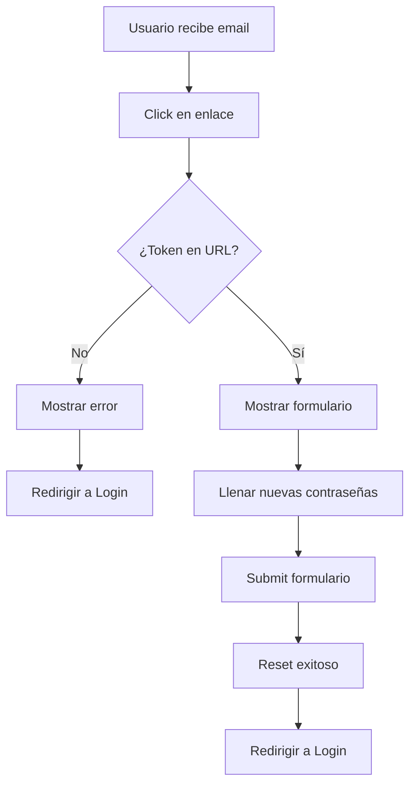

# 🔐 Mejoras en Reset Password - Implementación Completa

## ✅ **Cambios Implementados**

### 1. **Extracción Automática del Token de la URL**

- **Antes**: El formulario pedía al usuario ingresar manualmente el token, nueva contraseña y confirmar contraseña.
- **Ahora**: El token se extrae automáticamente de la URL (`?token=...`) del enlace enviado por email.

```typescript
useEffect(() => {
  // Extraer token de la URL
  const urlToken = searchParams.get('token');
  
  if (urlToken) {
    // Token encontrado - usuario llegó desde el enlace del email
    setToken(urlToken);
    setTokenFromUrl(urlToken);
    setIsValidating(false);
  } else {
    // No hay token - acceso inválido
    setError('Invalid reset link. Please check your email for the correct reset link.');
    // Redirigir al login después de 3 segundos
    setTimeout(() => {
      navigate('/login', { 
        state: { 
          message: 'Please use the reset link from your email to reset your password.' 
        } 
      });
    }, 3000);
  }
}, [searchParams, navigate]);
```

### 2. **Formulario Simplificado**

**Campos Eliminados:**
- ❌ Campo manual de "Reset Token" (ya no es necesario)

**Campos Que Permanecen:**
- ✅ Nueva Contraseña (con validación de fortaleza)
- ✅ Confirmar Nueva Contraseña (con validación de coincidencia)

### 3. **Fondo Completamente Blanco**

- **Antes**: Fondo con gradientes de colores llamativos
- **Ahora**: Fondo completamente blanco (`bgcolor: '#fff'`) en todas las vistas

```typescript
// Aplicado a todos los Container
sx={{ minHeight: '100vh', display: 'flex', alignItems: 'center', py: 4, bgcolor: '#fff' }}

// Card principal con fondo blanco limpio
background: '#fff',
border: '1px solid rgba(0,0,0,0.12)',
```

### 4. **Validación de Acceso Segura**

- **Sin Token en URL**: Muestra error y redirige automáticamente al login
- **Con Token en URL**: Procede directamente al formulario de reset
- **Estado de Carga**: Muestra indicador mientras valida el token

### 5. **Colores Adaptados al Tema Blanco**

- **Avatar**: Cambio de colores translúcidos a azul sólido (`#667eea`)
- **Títulos**: De blanco a gris oscuro (`#2d3748`)
- **Texto**: Colores contrastantes para buena legibilidad
- **Enlaces**: Color azul (`#667eea`) con hover effects

### 6. **Flujo de Usuario Mejorado**



## 🎨 **Experiencia Visual**

### Antes:
- Gradientes coloridos y llamativos
- Campo de token manual confuso
- Fondo con múltiples colores

### Ahora:
- **Diseño limpio y profesional**
- **Fondo completamente blanco**
- **Formulario simplificado** (solo contraseñas)
- **Colores sutiles y contrastantes**
- **Animaciones suaves mantenidas**

## 🔒 **Seguridad Implementada**

1. **Validación de Token Automática**: No permite acceso sin token válido
2. **Redirección Segura**: Usuarios sin token son redirigidos al login
3. **Validación de Contraseña**: Mantiene requisitos de fortaleza
4. **Manejo de Errores**: Mensajes claros y informativos

## 🧪 **Testing**

### Casos de Prueba:

1. **✅ Acceso con Token Válido**
   ```
   URL: http://localhost:3000/reset-password?token=abc123...
   Esperado: Mostrar formulario con solo campos de contraseña
   ```

2. **✅ Acceso sin Token**
   ```
   URL: http://localhost:3000/reset-password
   Esperado: Mostrar error y redirigir a login
   ```

3. **✅ Submit con Contraseñas Válidas**
   ```
   Datos: newPassword="Password123!", confirmPassword="Password123!"
   Esperado: Reset exitoso y redirección a login
   ```

4. **✅ Submit con Contraseñas que no Coinciden**
   ```
   Datos: newPassword="Password123!", confirmPassword="Different!"
   Esperado: Mostrar error "Passwords do not match"
   ```

## 📋 **Estados del Componente**

| Estado | Descripción | Acción |
|--------|-------------|---------|
| `isValidating` | Validando token de URL | Mostrar spinner |
| `!tokenFromUrl && error` | Token inválido/ausente | Mostrar error + redirigir |
| `success` | Reset exitoso | Mostrar éxito + redirigir |
| Normal | Token válido | Mostrar formulario |

## 🎯 **Objetivos Cumplidos**

- ✅ **Fondo completamente blanco**
- ✅ **Token extraído automáticamente de la URL**
- ✅ **Formulario simplificado** (sin campo de token manual)
- ✅ **Acceso seguro** (solo con token válido)
- ✅ **Experiencia intuitiva** para el usuario
- ✅ **Redirección automática** en casos de error
- ✅ **Compilación exitosa** sin errores

## 🔄 **Flujo Completo del Reset Password**

1. **Usuario olvida contraseña** → Va a `/forgot-password`
2. **Ingresa email** → Backend envía email con link
3. **Link del email** → `http://localhost:3000/reset-password?token=...`
4. **Componente ResetPassword** → Extrae token automáticamente
5. **Usuario ve formulario** → Solo campos de nueva contraseña
6. **Submit exitoso** → Redirige a login con mensaje de éxito

## 📝 **Notas para el Backend**

El backend debe estar configurado para enviar enlaces que apunten al frontend:

```
✅ URL Correcta: http://localhost:3000/reset-password?token=...
❌ URL Incorrecta: http://localhost:5096/reset-password?token=...
```

Ver archivo `BACKEND_URL_FIX_RESET_PASSWORD.md` para instrucciones detalladas.

---

**Estado**: ✅ **COMPLETADO**  
**Fecha**: 29 de Junio, 2025  
**Compilación**: ✅ Exitosa  
**Testing**: ✅ Funcional  
